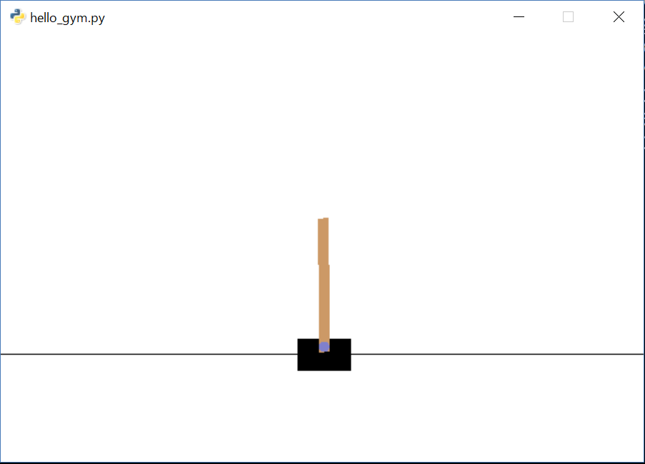
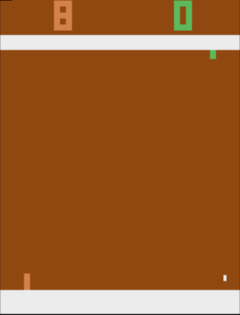

# Tech Circle OpenAI Gym Handson

Tech-Circle #18 「Pythonではじめる強化学習 OpenAI Gym 体験ハンズオン」のハンズオン資料です。

## Setup

事前準備としてOpenAI GymとChainerをインストールします(ChainerはOptionalのハンズオンでのみ必要なため、そこまで行わなければインストールの必要はありません)。  
Windowsの場合、atariのゲームを動かす環境の構築(手順5以降)はネイティブでは非常に困難です。そのため、以下を参考にbash on Windows環境を構築し、bash環境(=Ubuntu環境)で環境構築を行ってください。

[Bash on Ubuntu on Windowsをインストールしてみよう！](http://qiita.com/Aruneko/items/c79810b0b015bebf30bb)

また、bash on Windows側から画面を描写するのに[vcXsrv](https://sourceforge.net/projects/vcxsrv/)か[Xming](https://sourceforge.net/projects/xming/)のインストールが必要です。
インストールするのは新しいvcXsrvのほうが良いですが、動かないケースが報告されているのでその場合はXmingを試してみてください。
これらをインストールしServerを起動すると、スクリーンが立ち上がります。bash側で`export DISPLAY=:0`を行い出力先をこのスクリーンに設定することで、実行結果を確認できます(`.bashrc`に書いておくと実行し忘れを防げます)。

1. Pythonのインストール  
Pythonは3を利用します。[こちら](http://qiita.com/icoxfog417/items/e8f97a6acad07903b5b0#python%E3%81%AE%E3%82%BB%E3%83%83%E3%83%88%E3%82%A2%E3%83%83%E3%83%97)などを参考に、Pythonのインストールを行ってください。
なお、bash on Windowsを利用している場合Linuxベースの環境構築となります(中身はUbuntuのため)。
Windows側でPythonがインストールされていてもそれはbash環境とは別個なので、仮にWindows側でPythonをインストールしていてもbash側でもインストールを行う必要がある点に注意してください。
2. リポジトリのfork/clone  
本リポジトリをforkし、cloneしてください(良ければStarもよろしくですm(_ _)m)。以後、cloneしたフォルダ(`techcircle_openai_handson`)の中で作業をしていきます。
3. OpenAI Gymのインストール  
`pip install gym`でOKです。なお、インストールは`virtualenv`や`conda`を使い、仮想環境にインストールすることをお勧めします。仮想環境の作成についての詳細は、上記のリンク先の資料をご参照ください。
4. Gymの動作確認  
    本リポジトリの中にある`confirm_hello_gym.py`を実行し動くかどうかを確認してください。  

    ```
    python confirm_hello_gym.py
    ```

    上手くインストールできていれば、以下のようにCartPoleが動くはずです。特にWindowsで環境構築を行っている場合は、まずここで実行を確認しておいてください。
    
    
5. 依存モジュールのインストール  
ここから、gymでatariのゲームが扱えるよう追加のインストールを行っていきます。[公式ページ](https://github.com/openai/gym#installing-everything)に記載の通り、atari環境を実行するのに必要なライブラリなどをインストールします。
6. atari環境のインストール  
`pip install 'gym[atari]'` でインストールを行います
7. Chainerのインストール  
`pip install chainer`でインストールします
8. atariの動作確認  
     本リポジトリの、`confirm_dqn_env.py`を実行し動くかどうか確認してください。

    ```
    python confirm_dqn_env.py
    ```

    


これで準備は完了です。お疲れさまでした！

### Trouble Shuooting

* Windowsの場合、atari環境の実行のために`python-opengl`の追加インストールが必要かもしれません
* Windowsの場合、Xmingでないと動かないという報告がありました
* Python 3.5とChainer(1.17)を組み合わせて使う場合、`export CHAINER_PYTHON_350_FORCE=1`の設定が必要になる可能性があります

## Lecture

[Pythonではじめる強化学習 OpenAI Gym 体験ハンズオン 講義編](http://www.slideshare.net/takahirokubo7792/techcircle-18-python-openai-gym)

## Hands on

### [Start Handson!](https://github.com/icoxfog417/techcircle_openai_handson/tree/master/handson_1)

### Contents

* [Let's Start OpenAI Gym (5min)](https://github.com/icoxfog417/techcircle_openai_handson/tree/master/handson_1)
 * OpenAI Gymを使って、学習環境を動かしてみましょう
* [Deploy Agent to Environment (5min)](https://github.com/icoxfog417/techcircle_openai_handson/tree/master/handson_2)
 * actionを行うAgentを、学習環境の中に配置してみましょう
* [Train Agent by Reward (10min)](https://github.com/icoxfog417/techcircle_openai_handson/tree/master/handson_3)
 * agentを、報酬により教育してみましょう。ここで、Q-learningを利用します。
* [Optional] [Submit Your Agent to OpenAI Gym](https://github.com/icoxfog417/techcircle_openai_handson/tree/master/handson_optional)
 * 学習させたエージェントを、OpenAI Gymに投稿してみましょう

解答編は以下になります

[Handson Answer](https://github.com/icoxfog417/techcircle_openai_handson/tree/answer)

### Trouble Shuooting

* Pythonはインデントで制御構造を判断するため、インデントには気を付けてください
* インデントをつける際、空白を利用するかタブを利用するかは統一されている必要があります。ハンズオンのコードは空白を利用しているため、タブを混在させてしまわないよう、注意してください
* コードは、UTF-8(BOM無)で保存する必要があります。Windowsの一部のエディタでは保存時Shift-JISになってしまうので、注意してください
* コマンドの実行が上手くいかない際は、所定のフォルダにいるかどうかを確認してください。optional以外は、それぞれ該当のフォルダ上(例えば、`handson_1`ならコマンドプロンプト/ターミナルの`cd`コマンドで`handson_1`フォルダに移動してからコマンドを実行する必要があります)
* `python --version`でPython3系を利用しているか確認してください。`pyenv`などを利用せずPython3をインストールした場合、`python3`コマンドを利用することで明示的にPythonを3系で動かすことができます。
* コマンドの実行時には、仮想環境を利用している場合activateされているか、またWindowsの場合表示用の画面を立ち上げているかを確認してください
