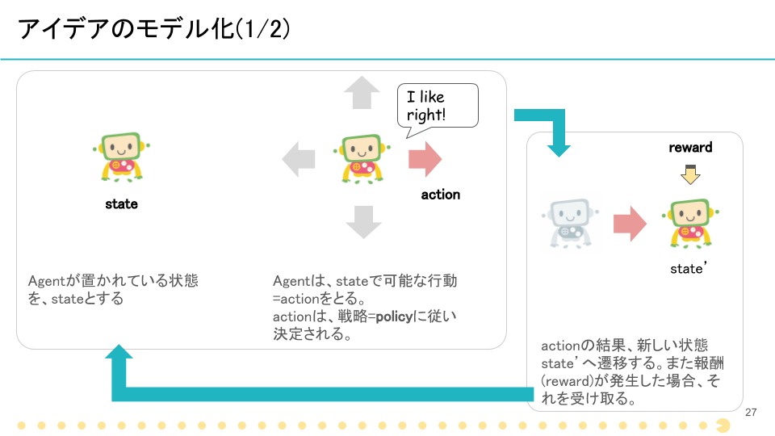

# Deploy Agent to Environment

学習環境の中に、行動を行うAgentを配置してみます。

* 環境から状態を観測する
* 観測した状態を基に行動する
* 行動の結果、次の環境に遷移する。報酬が発生した場合それを得る

この一連のプロセスを体感してみましょう。



今回用意しているエージェントは、以下の3種類です。

* `Random Agent`: 完全にランダムに行動するAgent
* `FunFun Agent`: フンフンディフェンスを行うAgent
* `Track Agent`: ボールを追いかけるAgent

これらのエージェントは、行動を決定する方法は異なりますが、「観測した状態から、行動を決定する」という点では変わりません。コードの中では、以下の個所(25行目)でこの処理を行っています。

```python
action = agent.act(observation)
```

では、実際にエージェントを切り替えながらその行動の違いを見てみましょう。  
コードを実装するのは、`handson2.py`の`your code here`と書かれいている個所(16行目)になります。

各エージェントの実装コードは以下の通りです。

* `agent = RandomAgent(action_number)`
* `agent = FunFunAgent(action_up, action_down, action_stop)`
* `agent = TrackAgent(action_up, action_down, action_stop)`

これらのコードを、実装する箇所に書いてみてください。その後、以下のコマンドでスクリプトを実行します。

```
python handson2.py
```

各エージェントごとの、挙動の違いが確認できると思います。

全て終わったら、自分なりのルールに基づいたエージェントの実装にも挑戦してみてください。

[handson2.py answer](https://github.com/icoxfog417/techcircle_openai_handson/blob/answer/handson_2/handson2.py)
