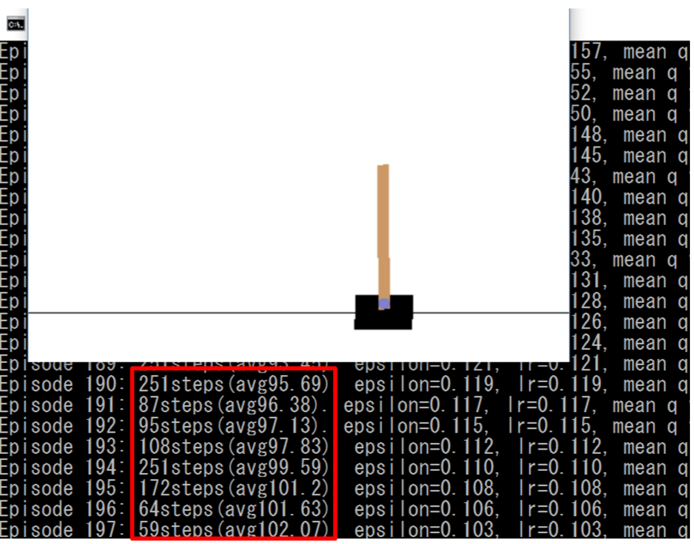
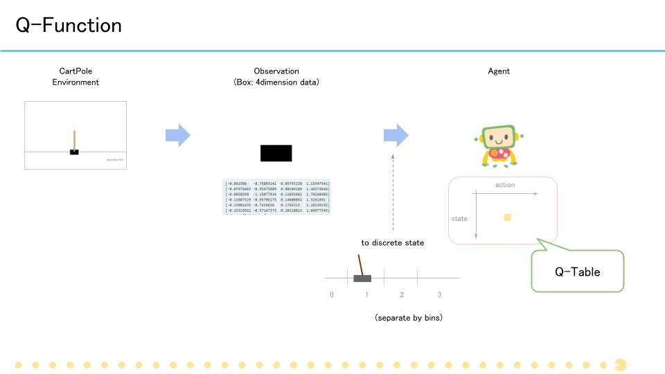
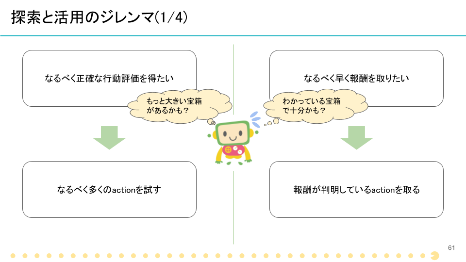
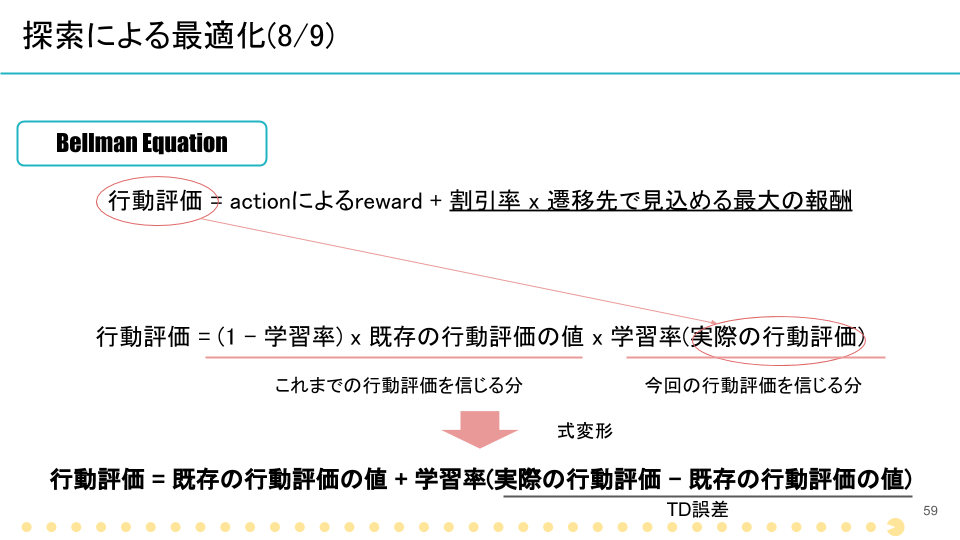
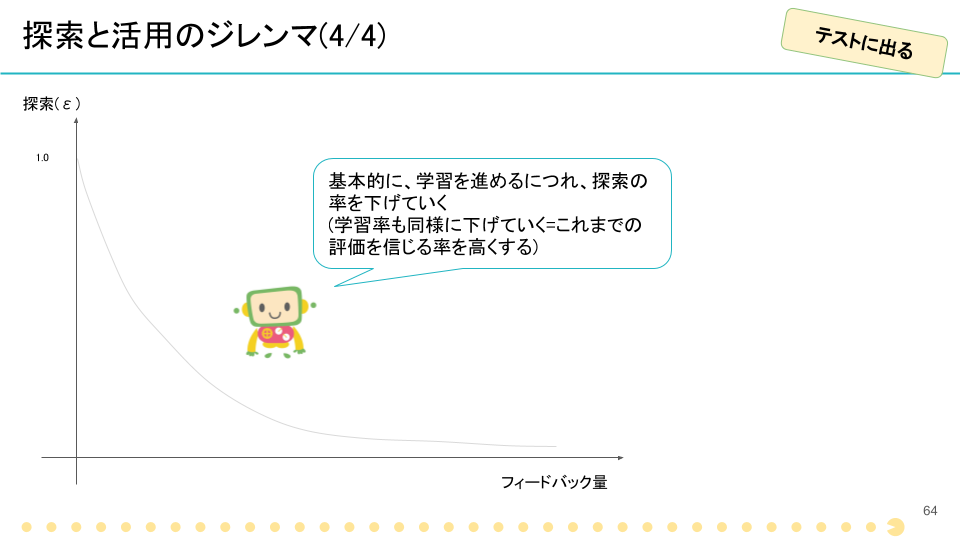

# Train Agent by Reward

今までのエージェントは固定されたルールに基づいた行動をとっていましたが、ここではいよいよ学習をさせてみます。  
学習に使用するのは、Q-learningです。

そして、学習対象の環境は`CartPole-v0`とします。この環境での目的は、カートをうまく動かして棒がなるべく長い時間倒れないようにすることです。




赤で囲った個所の、stepがなるべく大きくなるよう、カートの動かし方を学習させます。  
(倒れた瞬間に次のエピソードに行くのであたかもずっと立っているかのように見えるかもしれませんが、エピソードが切り替わっていたらそれは死んでいるということです)。

## Q-function (q.py)

はじめに、エージェントの行動を決定する関数であるQ-functionを作成します。  
これは、行動評価を定義する関数で、端的には「ある状態の時、どんな行動が、どれぐらいいいか」を出力するものです。

今回は、簡単な実装であるQ-Tableを利用します。

Q-Tableは、縦軸に状態、横軸に行動をとり、中の値が行動評価であるクロス表のイメージになります。  
「クロス表」にまとめるために、Q-Tableを利用するときは状態と行動がどちらも離散的である必要があります。ただ、今回のCartPoleは、その位置が連続的な値なので、これを区間に分けて離散的な値で表現することにします。

少し難しくなりましたが、イメージは以下の図のようになります。



CartPoleの位置が、0,1,2といった離散的な値になっているのがわかると思います。  
Q-Tableは、「位置が2の時に行動3を取ったときの行動評価は、0.1」というような感じで値を保持します。

実装は少し難しくなるので、今回はすでに用意したコードを作成します。

実装は`handson_3/q.py`の中にあるので、興味がある方は参照してみてください。  
[`Q.values`関数](https://github.com/icoxfog417/techcircle_openai_handson/blob/answer/handson_3/q.py#L55)によって、引数によって与えた`observation`における各アクション評価値を取り出すことができます。コード上で押さえておくべき点は、とりあえずこれだけです。

## Agent (agent.py)

続いて、このQ-functionを基に行動するAgentを実装します。

Q-learningを使用する場合、Agentには探索と活用のジレンマがありました。これを表現したものが、ε-greedy法です。



これをAgentに実装します。`agent.py`の中の`act`関数を、以下のように編集してください。

```python
    def act(self, observation):
        # your code here
        action = -1
        if np.random.random() < self.epsilon:
            action = np.random.choice(self.q.n_actions)
        else:
            action = np.argmax(self.q.values(observation))
        
        return action

```

* 乱数を発生させepsilon以下である場合(つまり、epsilonの確率で)、ランダムに行動します(=探索)
* epsilon以外の時は、これまでの学習結果を利用して行動を決定します(活用)
 * 先ほど定義した`Q.values`関数から与えられたobservationでの各アクションの行動評価(配列)を得て、もっとも行動評価が高いものをactionとして採用しています。(argmaxは、値が最大のもののインデックスを取る関数です)

これで、Agentの実装は終了です。

しかし、このままではなにも学習しないのでずっと賢くないままです。そこで、このAgentを学習させるコードを実装します。

[agent.py answer](https://github.com/icoxfog417/techcircle_openai_handson/blob/answer/handson_3/agent.py)

## Trainer (trainer.py)

Agentを学習させるTrainerを実装します。

Agentの行動を決定するQ-functionは、どう更新すればよかったでしょうか?  
Q-learningを思い返してみましょう。



計算に必要な主な要素は、以下でした。

* 既存の行動評価の値
* 実際の行動評価
 * actionによるreward
 * 遷移先で見込める最大の報酬

これを基に、`trainer.py`の`your code here 1`と書かれた箇所に、以下のコードを追加します。

```python
                future = 0 if done else np.max(self.agent.q.values(next_obs))
                value = self.agent.q.table[state][action]
                self.agent.q.table[state][action] += lr * (reward + self.gamma * future - value)
```

実際のコードとの対応は、以下のようになっています。

* 既存の行動評価の値 = `value`
* 実際の行動評価
 * actionによるreward = `reward`
 * 遷移先で見込める最大の報酬 = `future` (遷移先である`next_obs`における最大の行動評価)

なお、`lr`は学習率、`gamma`は割引率となります。このように、更新については本当に実際の定義通り実装されているのがわかると思います。


そして、学習に際してはもう一つ重要なことがありました。それは、探索の割合、また学習率を徐々に減らしていくということです。
今回は、「減らし方」を外部から受け取るようにしています。そのため、エピソードが終了した段階で、受け取った減らし方の通りにパラメーターを調整します。

`trainer.py`の`your code here 2`と書かれた箇所に、以下のコードを追加してください。



```python
                if self.epsilon_decay is not None:
                    self.agent.epsilon = self.epsilon_decay(self.agent.epsilon, i)
                if self.learning_rate_decay is not None:
                    lr = self.learning_rate_decay(lr, i)

```

これで学習の準備は整いました！

最後に、以下のコマンドを実行して学習がきちんと進んでいるか、確認してみてください。

```
python handson3.py --render
```

しばらくたつと、ポールをキープする時間が長くなっていくのがわかると思います。

[trainer.py answer](https://github.com/icoxfog417/techcircle_openai_handson/blob/answer/handson_3/trainer.py)
