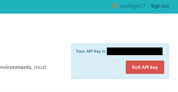

# Optional Handson

## Submit Your Agent to OpenAI Gym

エージェントをうまく学習でき、良い結果ができたら[OpenAI Gym](https://gym.openai.com/)にアップロードしてみましょう。

* まず、OpenAI Gymでアカウントを作成してください
* アカウントを作成すると、自分のページからAPI Keyが確認できるので、これをエディタなどにコピペしておいてください  



API Keyが用意できたら、`handson_3`で、`handson3.py`を実行する際`--monitor`オプションをつけて学習を行います。

```
python handson3.py --monitor
```

すると、学習の様子が動画として記録されます。記録ができたら、これをAPI Keyを使ってアップロードします。

```
python handson3.py --upload 取得したAPIKey
```

これで、結果がOpenAI Gymにアップロードされます。  
中を見ていただくとわかる通り、`gym.upload`で結果のアップロードができるようになっています。

単純にアップロードしただけでなく、その実装コードなどについての説明を[Gist](https://gist.github.com/)を使って付けることができます。きちんとこの説明をつけると、`Writeup`というマークがつきます。


## Try DQN 

Deep Q-Networkを試してみたい場合、以下のリポジトリでPongのゲームをChainerで学習するよう実装したコードを格納しています。

[chainer_pong](https://github.com/icoxfog417/chainer_pong)

こちらのリポジトリをcloneし、cloneしたディレクトリに移って、以下のコマンドを実行をしてみてください。

```
python run.py
```

こちらは、学習に時間がかかるためすぐには結果は出ません(CPUの場合数日かかります)。学習済みのモデルが同胞されているので、学習済みのものを試したい方は使ってみてください。

